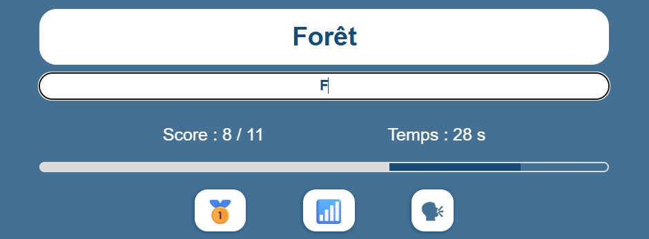
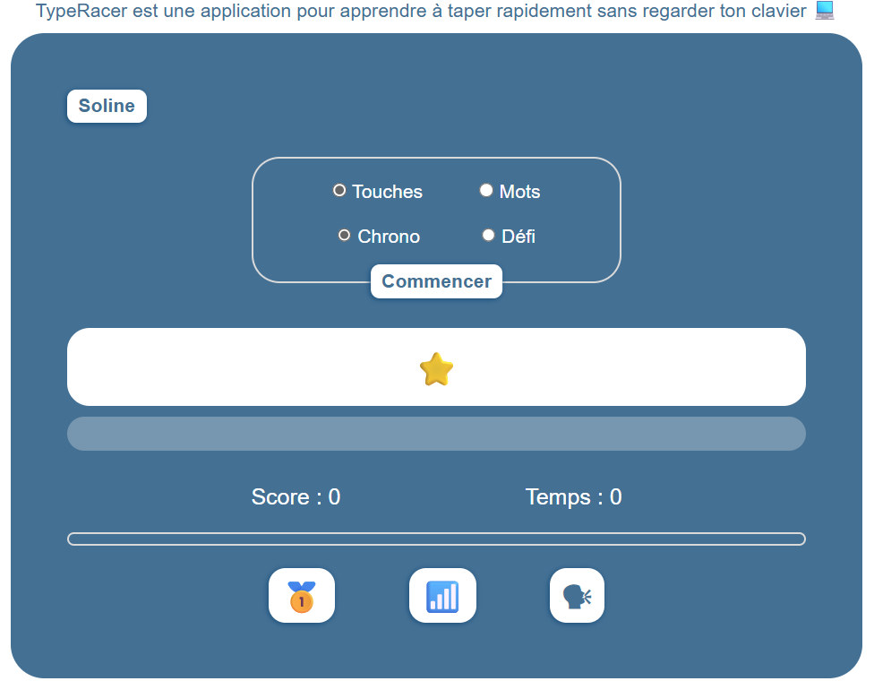
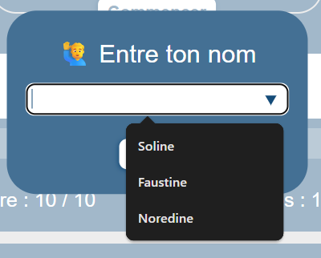
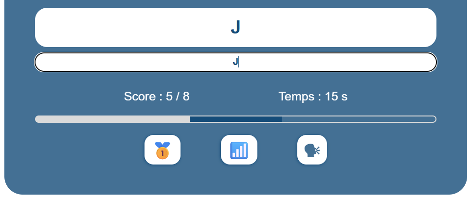
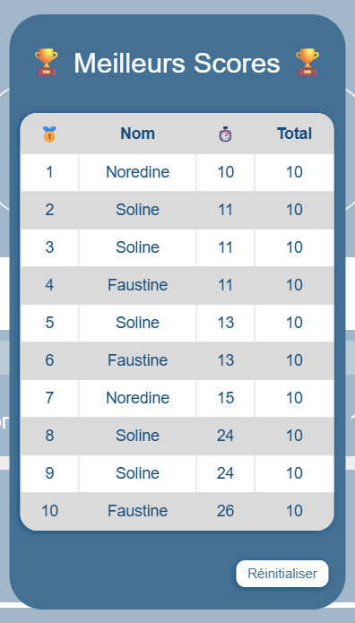
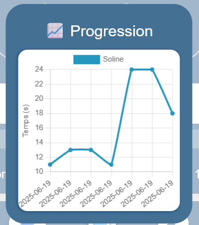

# TypeRacer

Améliore ta vitesse de frappe et deviens un pro du clavier ⌨ avec TypeRacer! Une application ludique pour s'entraîner à taper des lettres ou des mots apparaissant à l'écran le plus vite possible sans regarder ton clavier. ᯓ🏃🏻‍♀️‍➡️  
🔗 <a href="https://mathildeguedon.github.io/TypeRacer" target="_blank" rel="noopener noreferrer">Voir l'application en ligne</a>

## Aperçu visuel

## Fonctionnalités

- 🎲 **Entraînement interactif** : Améliore ta dactylographie avec des lettres et des mots aléatoires.
- ⏳ **Deux modes de jeu** : Chrono (1 minute pour un maximum de propositions) ou Défi (10 propositions en un minimum de temps).
- ➖ **Barre de score** : Visualise l'évolution de ton score au cours de la partie.
- ⏱️ **Chronomètre** : Surveille l'avancée du temps en direct.
- 💪 **Compétition** : Plusieurs joueurs peuvent s'affronter à tour de rôle.
- 🏅 **Tableau des meilleurs scores** : Suis tes progrès et compare-toi aux autres.
- 📈 **Graphique de progression** : Visualise ton amélioration au fur et à mesure des parties.
- 📲 **Enregistrement en local** : Retrouve tes anciens scores même après avoir fermé l'application.
- 📣 **Partage** : Envoie un message à un ami et partage tes exploits.
- ⛶ **Ecran responsive** : Joue sur mobile, tablette ou ordinateur.

## Installation

Prêt à commencer ? Clone le repository et lance l'application en ouvrant le fichier index.html dans ton navigateur.  
👉 Tu peux aussi simplement <a href="https://MathildeGuedon.github.io/TypeRacer" target="_blank" rel="noopener noreferrer">visiter le projet</a> sur GitHub Pages. 

## Technologies utilisées
- HTML5, CSS3
- JavaScript vanilla
- Chart.js

## Objectifs pédagogiques

Ce projet m’a permis de :
- </> Mettre en oeuvre du **HTML/CSS**.
- ｡🇯‌🇸‌ Approfondir mes compétences en **JavaScript vanilla** (événements utilisateur, validation de formulaire, manipulation du DOM, gestion des popups).
- ♿ Prendre en compte l'**accessibilité** du site (légendes au survol des boutons, Placeholders du formulaire).
- ✨ Maximiser l'**expérience utilisateur** (menu déroulant avec aide à la saisie du nom du joueur, récupération du dernier joueur ayant terminé une partie à l'ouverture de l'application, placement automatique du curseur dans la zone de saisie au commencement d'une partie, désactivation des boutons pendant une partie).
- 📘 Intégrer une **librairie** externe à l'application (Chart.js).

## Attribution

Ce projet est basé en partie sur le travail de David Pierru, OpenClassrooms (https://github.com/OpenClassrooms-Student-Center/7696886-javascript/tree/main), qui est sous licence CC BY-SA 4.0 (https://creativecommons.org/licenses/by-sa/4.0/).

## Licence

Ce projet est sous licence CCBY-SA 4.0 (https://creativecommons.org/licenses/by-sa/4.0/).

## Captures d'écran

### Ecran principal de l'application

### Popup de changement de joueur

### Score, chronomètre et barre de score évolutifs en temps réel

### Popup des meilleurs scores

### Popup de l'évolution des scores

## Contact

Mathilde Guédon - mathilde2.guedon@hotmail.fr - 
<a href="https://www.linkedin.com/in/mathilde-guédon-a08a08369" target="_blank" rel="noopener noreferrer">LinkedIn</a>